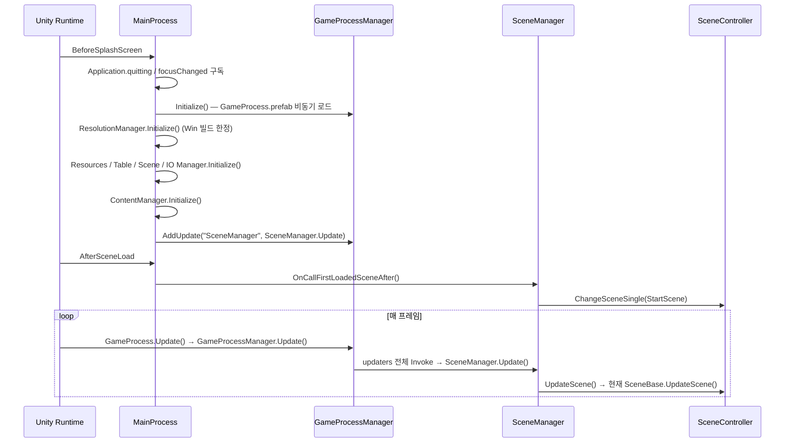

# Practice-UnityWindowApi — 코드 위키

Windows Native Window API + URP 투명 렌더링을 활용한 **데스크톱 오버레이형 게임 프레임워크 연습 프로젝트**.
게임 콘텐츠보다 **부트스트랩 / 씬 전환 / 리소스·테이블·세이브 파이프라인** 골격 설계가 주된 목적.

- Unity `6000.2.10f1` (Unity 6), URP `17.2.0`, 에셋 직렬화 = Force Text
- 비동기: `UniTask` (Cysharp, git URL 패키지)
- 서브모듈: `Assets/ThirdParty/UnityFramework-Extension` ([repo](https://github.com/Snack1511/UnityFramework-Extension.git))
- 어셈블리 정의(asmdef) 없음 → 전부 `Assembly-CSharp`에 컴파일됨

## 문서 인덱스

| 문서 | 내용 |
|---|---|
| [architecture.md](architecture.md) | 부트스트랩 순서, 매니저 3계층, 업데이트 펌프, 공용 패턴 |
| [scene-and-content.md](scene-and-content.md) | `SceneBase` 라이프사이클, `SceneController` 전환 경로 4종, 콘텐츠 시스템 |
| [data-and-resources.md](data-and-resources.md) | Resources 캐시, CSV 테이블, JSON 세이브, Model/Save 분리 설계 메모 |
| [window-native.md](window-native.md) | Win32 P/Invoke 창 제어, DWM, URP Blit 투명화 파이프라인 |
| [reference/desktop-overlay-unity6.md](reference/desktop-overlay-unity6.md) | **[외부 참고]** Unity 6.1 데스크톱 오버레이 구성법 + 현 프로젝트 설정 대조표 |
| [reference/uniwindowcontroller.md](reference/uniwindowcontroller.md) | **[외부 참고]** UniWindowController(MIT) API·설계 분석 + 기능 대조표 |

`reference/`는 **외부 자료를 분석해 둔 곳**이다. 프로젝트 코드 설명이 아니라 판단 근거용이며, 적용 여부와 무관하게 보관한다.

개선 제언은 [`/advise`](../advise/README.md) 폴더 참조. **위키는 "지금 어떻게 동작하는가", advise는 "어떻게 바꿔야 하는가"로 역할 분리.**

## 폴더 맵

```
Assets/
├─ Script/                     ← 프로젝트 코드 전체 (39 files)
│  ├─ GameFlow/                진입점 · 씬 정의 · 리소스 로더
│  │  ├─ MainProcess.cs        [RuntimeInitializeOnLoadMethod] 프로그램 진입/종료점
│  │  ├─ GameProcess.cs        DontDestroyOnLoad MonoBehaviour, Update 펌프
│  │  ├─ Loader.cs             Loader<T> — Resources 비동기 로드 1회용 래퍼
│  │  └─ GameScene/            SceneBase / SceneController / 씬별 구현 5종
│  ├─ Manager/
│  │  ├─ StaticManager/        static class — GameProcess, Resolution, WindowNative
│  │  ├─ SingletonManager/     Singleton<T> — Scene, Table, IO, (Resources는 예외*)
│  │  └─ MonoSingleManager/    MonoSingleton<T> — Content
│  ├─ GameContent/             ContentBase / ContentObject / 콘텐츠 3종 스텁 · UI
│  ├─ Pattern/                 Singleton<T>, MonoSingleton<T>, IState, EventBusLocater
│  ├─ Define/                  GameFlowDefine(진행률), ModelDefine(Model/Save 정의)
│  ├─ Controller/              MonoBehaviour 유틸 컴포넌트 5종
│  ├─ Shader/                  BlitFeature / BlitPass (URP ScriptableRendererFeature)
│  ├─ ScriptableObject/        GamePathDefine (정의만 존재, 코드에서 미사용)
│  └─ DebuggingComponent.cs    FPS OSD, 디버그 오브젝트 토글(Tab)
├─ Resources/                  런타임 로드 대상 전부 (Scenes/Prefabs/Table/Sprite/Shader/Material)
├─ SaveData/                   에디터 실행 시 세이브 파일이 여기 쓰임 (dataPath 기준)
├─ Settings/                   URP Asset / Renderer (PC · Mobile)
├─ ThirdParty/                 서브모듈 (Collection/Component/GameObject 확장 메서드)
└─ Plugins/                    DOTween(+Pro), SPUM, Febucci Text Animator, Live2D Cubism
```

\* `ResourcesManager`는 `SingletonManager/` 폴더에 있지만 실제로는 `MonoSingleton<T>` 상속. → [advise/004](../advise/004-architecture-scale.md)

## 부트 시퀀스



## 어디를 봐야 하나

| 하고 싶은 일 | 진입 파일 |
|---|---|
| 부팅 시 초기화 순서 바꾸기 | `Script/GameFlow/MainProcess.cs` |
| 매 프레임 콜백 추가 | `GameProcessManager.AddUpdate(key, action)` |
| 씬 추가 | `ESceneType` + `SceneManager.RegistScenes()` + **Build Settings 등록** |
| 씬 전환 | `SceneManager.Instance.ChangeScene(type, info, cb, isVisitLoadingScene)` |
| CSV 테이블 추가 | `TableDataBase` 상속 → `TableManager.LoadTableDataAsync<T>(path)` |
| 세이브 항목 추가 | `ESaveType` + `SaveBase` 상속 + `SaveDataFactory` + `IOManager.GetSaveType` (**3곳**) |
| 창 스타일/투명도 | `WindowNativeManager` / `Resources/Shader/MakeTransparent.shader` |
| 전역 이벤트 | `EventBusLocater.RegistService<T>` / `Notify` |

## 알아둘 것 (현재 상태)

- **Build Settings 등록 씬**: StartScene, LoadingScene, GameScene, TestScene.
  `ESceneType`에 있는 **LobbyScene / MenuScene은 미등록**, 반대로 GameScene은 `ESceneType`에 없음.
  → 현재 `StartScene → LobbyScene` 전환은 실패한다. [advise/001](../advise/001-build-blockers.md)
- 런타임 스크립트에 `UnityEditor` 네임스페이스 참조가 남아 있어 **플레이어 빌드가 컴파일되지 않는다.** 동일 문서 참조.
- `StartScene.OnLoadResourceAsync`(10초 가짜 진행률)는 현재 흐름에서 **호출되지 않는다** — `ChangeSceneSingle` 경로는 로딩 훅을 타지 않음.
- 세이브 파일은 `Application.dataPath` 기준 → 에디터에서는 `Assets/SaveData/`, 빌드에서는 쓰기 불가 영역.
