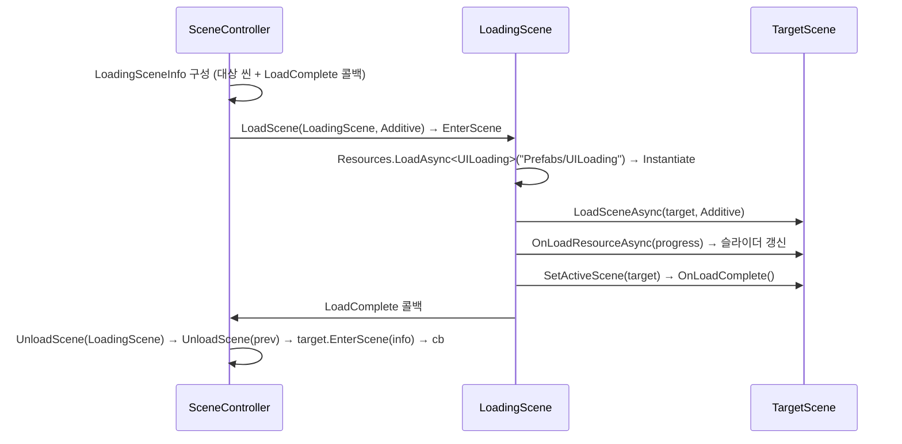

# 씬 시스템 · 콘텐츠 시스템

## 1. 두 겹 구조

이 프로젝트의 "씬"은 두 층으로 되어 있다.

| 층 | 실체 | 수명 |
|---|---|---|
| **로직 씬** | `SceneBase` 파생 C# 객체 | `SceneManager.Initialize()`에서 5개 전부 생성, **앱 종료까지 유지** |
| **유니티 씬** | `Assets/Resources/Scenes/*.unity` | `LoadSceneAsync` / `UnloadSceneAsync`로 로드·언로드 |

둘은 **`ESceneType.ToString()` 문자열로만 연결**된다 (`SceneController.cs:93, 118, 133`).
따라서 **enum 이름 == .unity 파일 이름 == Build Settings 등록명** 세 가지가 항상 일치해야 한다.
로직 씬 객체는 재사용되므로 `SceneBase`의 필드는 재진입 시 직접 초기화해줘야 한다(자동 리셋 없음).

## 2. `SceneBase` 라이프사이클

`Assets/Script/GameFlow/GameScene/SceneBase.cs`

```csharp
public abstract class SceneBase
{
    public ESceneType SceneType { get; protected set; }
    protected SceneBase(ESceneType SceneType)                        // 생성자에서 타입 고정

    public virtual void EnterScene(ISceneInfo context)               // 진입 — enterScene=true, _sceneInfo 보관
    public virtual void UpdateScene()                                // 매 프레임 (현재 씬만)
    public virtual UniTask OnLoadResourceAsync(IProgress<LoadingProgressResult>)  // 로딩씬 경유 시에만 호출
    public virtual void OnLoadComplete()                             // 로딩 완료 직후
    public virtual void ExitScene()                                  // 이탈 — ReleaseResource() + Resources.UnloadUnusedAssets()
    public virtual void ReleaseResource()                            // 씬별 리소스 해제 지점
    public virtual bool IsActiveScene()
}
```

`ISceneInfo`는 빈 마커 인터페이스 — 씬 전환 파라미터를 타입 안전하게 넘기기 위한 봉투.
받는 쪽에서 `sceneInfo as XxxSceneInfo`로 캐스팅한다 (`LoadingScene.cs:70`).

**로딩 진행률**은 `Script/Define/GameFlowDefine.cs`의 `LoadingProgressResult { float amount; }` (`ICloneable`).
`OnLoadResourceAsync`에 넘어온 `IProgress<T>.Report()`를 호출하면 로딩 UI 슬라이더가 갱신된다.

### 씬 구현 5종

| 클래스 | 상태 |
|---|---|
| `StartScene` | 진입 즉시 `ChangeScene(LobbyScene, isVisitLoadingScene:true)`. `OnLoadResourceAsync`에 10초짜리 가짜 진행률 코드가 있으나 **현재 흐름에서 호출되지 않음** |
| `LoadingScene` | 로딩 UI + 대상 씬 로드 파이프라인. 실질적으로 전환 오케스트레이터 |
| `LobbyScene` | `base` 호출만 하는 껍데기. 실제 로비 UI(`UILobbyPanel`, `GoldHUD` 프리팹)는 아직 미연결 |
| `MenuScene` | `LoadTable`/`LoadPrefab`/`UnloadTable`/`UnloadPrefab` 훅 자리만 잡혀 있음. 주석에 "로비 내부에서 메뉴를 띄우자"는 재검토 메모 |
| `TestScene` | 검증용. CSV 테이블 로드 + `A` 키로 세이브/로드 왕복 테스트 |

## 3. `SceneController` — 전환 경로 4종

`Assets/Script/GameFlow/GameScene/SceneController.cs`. `SceneManager`가 이 객체 하나만 들고 위임한다.
상태는 `currentScene` / `nextScene` 두 개의 `ESceneType`뿐.

### (a) `ChangeSceneSingle(type, info, cb)` — `:85`
`LoadSceneMode.Single`로 교체. 기존 씬은 Unity가 알아서 파기.
부팅 직후 StartScene 진입에만 사용된다 (`SceneManager.OnCallFirstLoadedSceneAfter`).

```
currentScene = type → LoadScene(Single) → EnterScene(info) → cb → UpdateCurrentSceneType()
```

### (b) `ChangeScene(type, info, cb, isVisitLoadingScene: true)` — `:39`
로딩씬을 경유하는 정식 경로. **`OnLoadResourceAsync` / `OnLoadComplete` 훅이 도는 유일한 경로.**



### (c) `ChangeScene(..., isVisitLoadingScene: false)` — `:65`
로딩씬 없이 대상 씬만 Additive 로드. 로딩 훅(`OnLoadResourceAsync`)은 돌지 않는다.

### (d) `ChangeSceneWithOutLoadSceneObject(type, info)` — `:150`
**유니티 씬을 건드리지 않고** 로직 씬만 교체. 하나의 .unity 안에서 논리 상태만 바꿀 때 쓰라고 만든 통로. 현재 호출처 없음.

> 씬을 실제로 언로드하는 것은 `UnloadScene()`이며, `ExitScene()`은 **언로드 완료 콜백에서** 호출된다 (`:136-139`). 즉 `ExitScene`은 지연 실행이다.

## 4. 씬 추가 절차

1. `ESceneType`에 항목 추가 (`SceneBase.cs:8`)
2. `SceneBase` 상속 클래스 작성 (`GameScene/` 폴더, 생성자에서 `base(SceneType)`)
3. `SceneManager.RegistScenes()`에 `AddScene(...)` 한 줄 추가 (`SceneManager.cs:34`)
4. `Assets/Resources/Scenes/<enum이름>.unity` 생성 — **파일명이 enum 이름과 정확히 일치해야 함**
5. **File > Build Profiles(Build Settings)의 Scene List에 등록** ← 누락 시 런타임에 조용히 실패

> 4·5번이 코드가 아니라 에디터 설정이라 자동 검증이 없다. 실제로 지금 LobbyScene/MenuScene이 5번에서 누락되어 있다. → [advise/001](../advise/001-build-blockers.md), [advise/002](../advise/002-scene-system.md)

## 5. 로딩 UI

`Assets/Script/GameContent/UILoading.cs` + `Resources/Prefabs/UILoading.prefab`

```csharp
public void ActiveLoadingUI();                              // gameObject.SetActive(true)
public void SetLoadingProgress(LoadingProgressResult info); // Slider.SetValueWithoutNotify(info.amount)
```

`LoadingScene.LoadingProcess`가 프리팹을 로드→Instantiate→로딩씬 첫 루트 오브젝트에 부착한다 (`LoadingScene.cs:43-51`).
인스턴스는 `static UILoading uiLoading` 필드에 보관되고 **명시적으로 Destroy되지 않는다** — 로딩씬 언로드에 의존.

## 6. 콘텐츠 시스템

씬과 **별개의 축**. 씬이 "화면 단위"라면 콘텐츠는 "게임플레이 모드 단위"(던전/마을/광산)로, `DontDestroyOnLoad`인 `ContentManager` 밑에 상주하며 씬 전환과 무관하게 살아 있다.

```
ContentManager (MonoSingleton, DontDestroyOnLoad)
└─ GameObject "EDungeon" (SetActive false)   ← ContentObject 컴포넌트
   └─ ContentDungeon : ContentBase            ← 순수 C# 컨트롤러
```

| 파일 | 역할 |
|---|---|
| `Manager/MonoSingleManager/ContentManager.cs` | 부팅 시 `EContentType` 3종의 GameObject를 생성(비활성)하고 `ActiveContent(type, bool)` 제공 |
| `GameContent/ContentObject.cs` | MonoBehaviour 껍데기. `EContentType`으로 컨트롤러를 switch 생성, 활성/비활성 위임 |
| `GameContent/ContentBase.cs` | `InitalizeContent(ContentInitInfo)` / `SetupContentUI()` / `ReleaseContent()` |
| `ContentDungeon` / `ContentVillage` / `ContentMine` | 전부 빈 스텁 |

```csharp
// 콘텐츠 켜기/끄기 — 씬 진입 타이밍에 호출하는 것을 상정한 API
ContentManager.Instance.ActiveContent(EContentType.EDungeon, true);
//  true  → contentController.SetupContentUI() 후 SetActive(true)
//  false → contentController.ReleaseContent()  후 SetActive(false)
```

**콘텐츠 추가 절차**: `EContentType` 추가 → `ContentBase` 상속 클래스 작성 → `ContentObject.CreateContentController` switch에 추가 → `ContentManager.Initialize`에 `AddContent` 추가 (**4곳**).
`ContentBase.InitalizeContent`는 오타(`Initalize`)지만 이미 오버라이드 계약이므로 바꾸려면 일괄 변경해야 한다. 지금 파생 클래스가 전부 비어 있는 **지금이 고치기 가장 싼 시점**이다.
